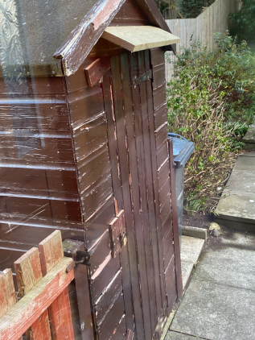
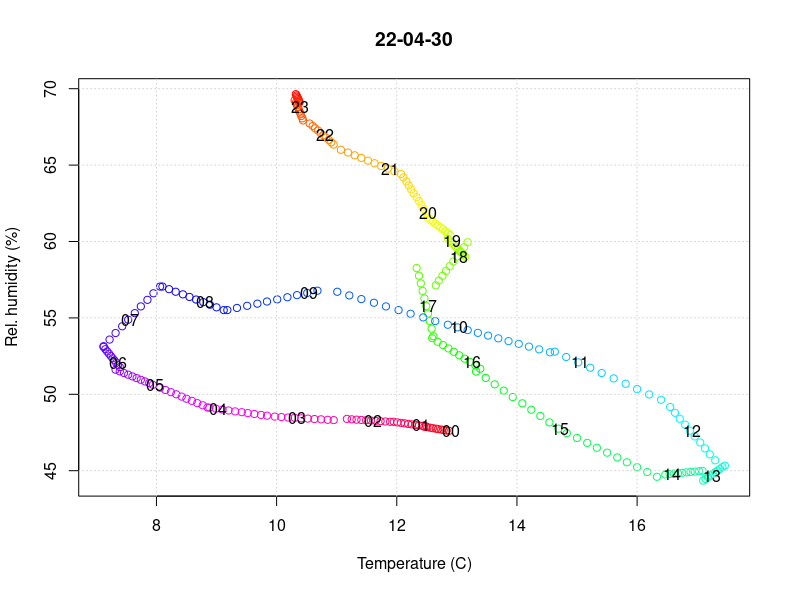

# cave-logs

A repo to store climate data from the man cave and code to analyse it.

## Hardware
Sensor: Inkbird IBS-TH2 PLUS

## One day
  
Relative humidity and temperature changing through the day. Colours indicate time of day. Black numbers on graph indicate full hours.
